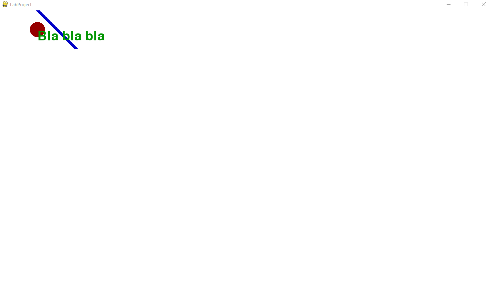
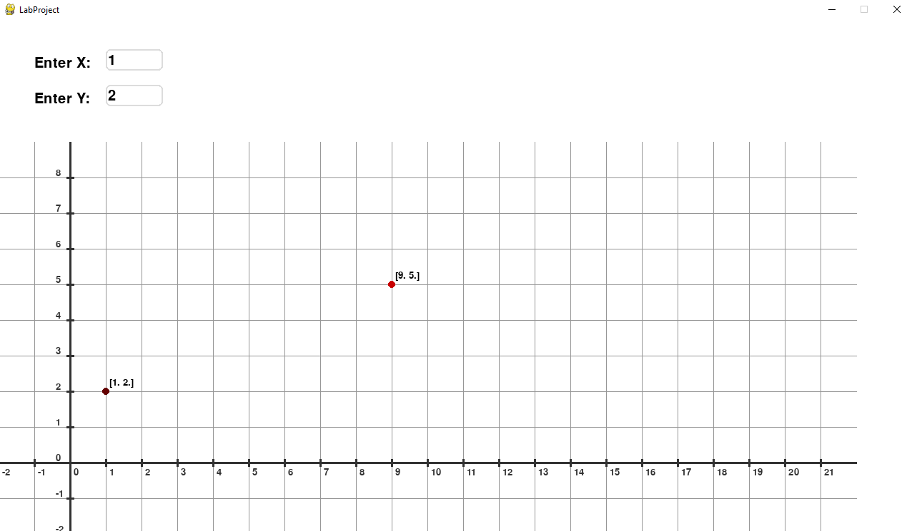
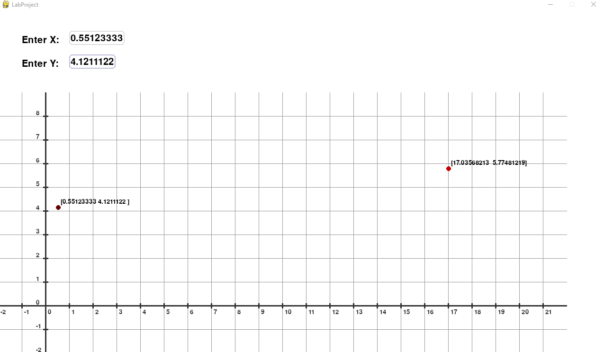
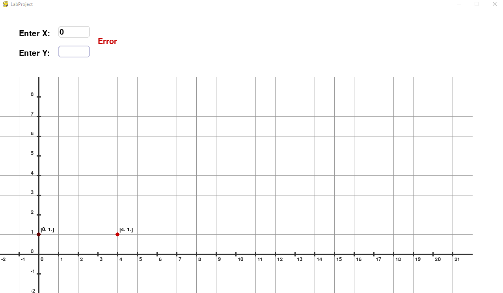
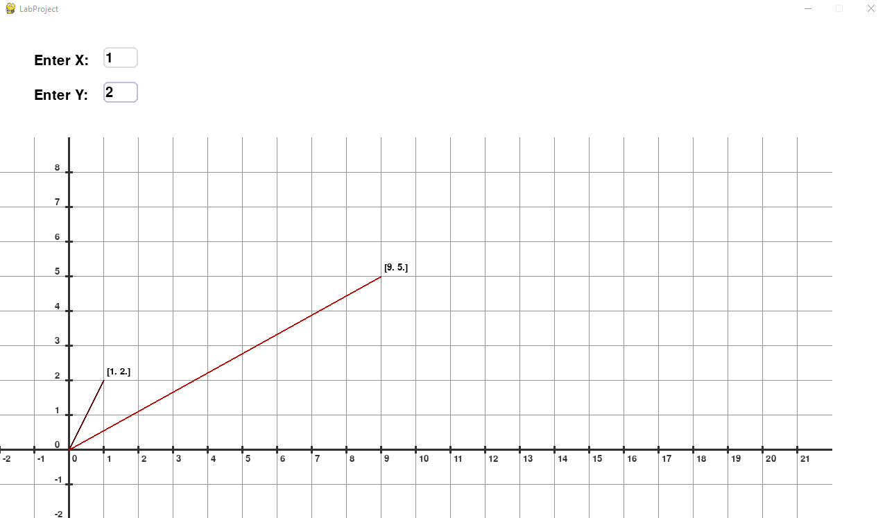
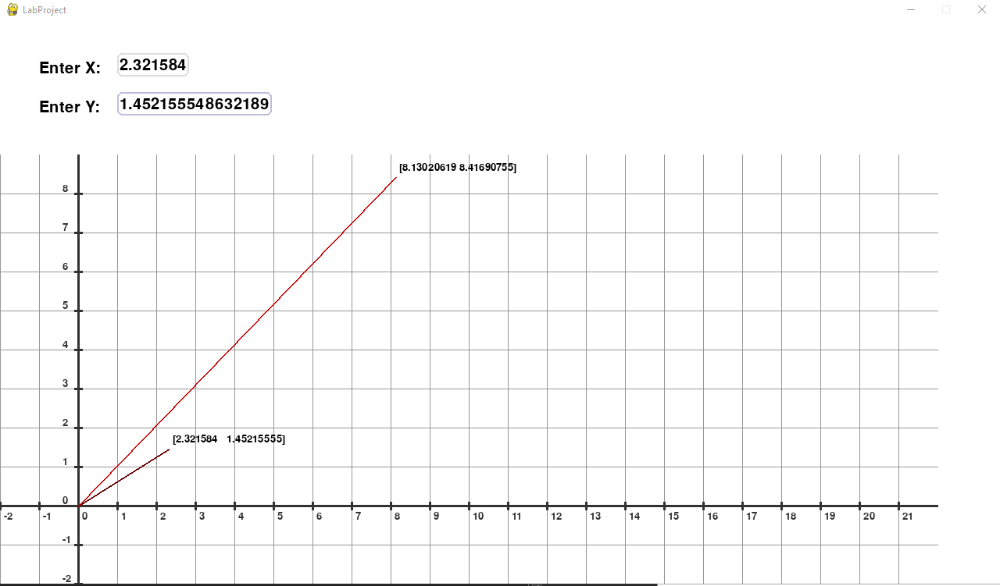

## ОТЧЁТ ПО ЛАБОРАТОРНОЙ РАБОТЕ №1 "Указатели, арифметика указателей"

**Оборудование:** ПК, Python, Numpy, Pygame

### Задание №1. 

Напишите программу, которая позволяет ввести с клавиатуры координаты точки на плоскости, а затем подвергает эти координаты матричному преобразованию с помощью матрицы 2x2. Результатом являются координаты новой точки на плоскости. Распечатать введённые координаты, матрицу преобразования и новые координаты. Матрица
преобразования координат дана в виде:  

$$ T = \begin{pmatrix} 1 & 3 \\ 4 & 1 \end{pmatrix} $$

**Решение:**


Для решения задания была написана следующая программа:
```python
import numpy

user_input = numpy.array([])
transform = numpy.array([[1, 3], [4, 1]])

print("Enter x and y:")
for i in range(2):
    element = int(input())
  
    user_input = numpy.append(user_input, element)
output = numpy.matmul(user_input, transform)

print("User input", user_input)
print("Transform", transform)
print("Output", output)
```

Результат выполнения программы:
```
Enter x and y:
1
2
User input [1. 2.]
Transform [[1 3][4 1]]
Output [9. 5.]
```

### Задание №2. 

Изучить прорисовку графических примитивов из библиотеки pygame - окружности, линии и текста. Нарисовать эти примитивы в окне программы разными цветами.

**Решение:**

Для решения задания была написана следующая программа.
*main.py* файл в котором мы запускаем нашу программу через экземпляр класса App

```python
from app import App

def main():
    myApp = App("LabProject", (1280, 720))
    myApp.run()

if __name__=="__main__":
    main()
```

В классе *App* происходит основной цикл программы, обработка ивентов, логики и отрисовки элементов сцены

```python
import sys, pygame
from myCanvas import MyCanvas

class App:
    is_running = True
    screen = None
    canvas = None
    fill_color = (255, 255, 255)

    def __init__(self, name, screen_size):
        pygame.init()
        pygame.display.set_caption(name)
        self.screen = pygame.display.set_mode(screen_size)
        self.canvas = MyCanvas(self.screen)

    def run(self):
        self.canvas.start()

        while self.is_running:
            self.system_input()
            self.screen.fill(self.fill_color)
            self.canvas.update()
            pygame.display.flip()
                            
        pygame.quit()
        sys.exit()
    
    def system_input(self):
        for event in pygame.event.get():
            if event.type == pygame.QUIT: self.is_running = False

    def set_fill_color(self, fill_color):
        self.fill_color = fill_color
```

Класс *Canvas* представляет собой сцену которая обрабатывает созданные сущности
```python
class Canvas:
    screen = None
    entitys = []

    def __init__(self, screen):
        self.screen = screen

    def start(self):
        pass

    def update(self):
        self.input_update()
        self.logic_update()
        self.render_update()
    
    def input_update(self):        
        for entity in self.entitys:
            entity.input_update()
    
    def logic_update(self):
        for entity in self.entitys:
            entity.logic_update()

    def render_update(self):
        for entity in self.entitys:
            entity.render_update()
```

Наследуя класс сцены, мы имеем класс, в котором можем сосредоточится на логике приложения, а не реализации конкретных графических методов.
```python
from cernel.canvas import Canvas
from cernel.entity import Entity
from renderers.circleRenderer import CircleRenderer
from renderers.lineRenderer import LineRenderer
from renderers.textRenderer import TextRenderer

class MyCanvas(Canvas):
    def start(self):
        circleRenderer = CircleRenderer(self.screen, (150,0,0), 20)
        circle = Entity(self.entitys, [100, 50], circleRenderer)

        lineRenderer = LineRenderer(self.screen, (0,0,200), (100,0), (200,100), 10)
        line = Entity(self.entitys, [0, 0], lineRenderer)

        textRenderer = TextRenderer(self.screen, (0,150,0), "Bla bla bla", 50)
        text = Entity(self.entitys, [100, 50], textRenderer)


    def update(self):
        super().update()
```

Класс *Entity* представляет собой абстракцию сущности или набора сущностей на экране.
```python
class Entity:
    position = [0,0]
    renderer = None

    def __init__(self, entitys, position, renderer):
        self.position = position
        self.renderer = renderer
        entitys.append(self)
    
    def input_update(self):
        pass
    
    def logic_update(self):
        pass

    def render_update(self):
        self.renderer.render(self.position)
    

    def set_renderer(self, renderer):
        self.renderer = renderer
```

*CircleRenderer* инкапсулирует логику отрисовки окружности.
```python
import pygame

class CircleRenderer:
    screen = None
    color = (0,0,0)
    radius = 1

    def __init__(self, screen, color, radius):
        self.screen = screen
        self.color = color
        self.radius = radius

    def render(self, position):
        pygame.draw.circle(
            self.screen,
            self.color,
            position,
            self.radius,
        )
```

*LineRenderer* инкапсулирует логику отрисовки линий.
```python
import pygame

class LineRenderer:
    screen = None
    color = (0,0,0)
    start_pos = (0,0)
    end_pos = (0,0)
    width = 1

    def __init__(self, screen, color, start_pos, end_pos, width):
        self.screen = screen
        self.color = color
        self.start_pos = start_pos
        self.end_pos = end_pos
        self.width = width

    def render(self, position):
        start_pos = (
            self.start_pos[0] + position[0],
            self.start_pos[1] + position[1],
        )
        end_pos = (
            self.end_pos[0] + position[0],
            self.end_pos[1] + position[1],
        )
        pygame.draw.line(
            self.screen,
            self.color,
            start_pos,
            end_pos,
            self.width
        )
```

*TextRenderer* инкапсулирует логику отрисовки текста используя системный шрифт *freesanbold*.
```python
import pygame

class TextRenderer:
    screen = None
    color = (0,0,0)
    font = None
    text = ""
    size = 1

    def __init__(self, screen, color, text, size):
        self.screen = screen
        self.color = color
        self.text = text
        self.size = size
        self.font = pygame.font.SysFont('freesanbold.ttf', size)

    def render(self, position):
        lable = self.font.render((self.text), True, self.color)
        self.screen.blit(lable, position )
    
```

Результат выполнения программы:



### Задание №3. 

Напишите программу, которая позволяет ввести с клавиатуры координаты точки на плоскости, а затем подвергает эти координаты матричному преобразованию с помощью матрицы 2x2. Результатом являются координаты новой точки на плоскости. Распечатать введённые координаты, матрицу преобразования и новые координаты. Матрица преобразования координат дана в виде: 

$$ T = \begin{pmatrix} 1 & 3 \\ 4 & 1 \end{pmatrix} $$

Прорисовать изначальную точку и точку с новыми координатами в виде двух небольших окружностей разными цветами. Рядом с точками напечатать соответствующими цветами значения координат точек в игровом окне программы.

**Решение:**

К предыдущей программе были дополнительно реализованы следящие классы:
- *RectRenderer* для инкапсуляции логики отрисовки прямоугольников.

```python
import pygame
from kernel.utility import to_pygame

class RectRenderer:
    def __init__(self, screen, color, size, border_size = 0, border_radius = 0):
        self.screen = screen
        self.color = color
        self.size = size
        self.border_size = border_size
        self.border_radius = border_radius

    def render(self, position):
        position = to_pygame(position, self.screen.get_size()[1], self.size[1])
        pygame.draw.rect(
            self.screen,
            self.color,
            pygame.Rect(position, self.size),
            self.border_size,
            self.border_radius
        )
```

*InputBox* для создания полей ввода имеющая внутри себя сущность с отрисовкой прямоугольника и сущность с отрисовкой текста.
```python
import pygame
from kernel.entity import Entity
from kernel.utility import to_pygame
from renderers.rectRenderer import RectRenderer
from renderers.textRenderer import TextRenderer

class InputBox(Entity):

    def __init__(self, entitys, screen, position, size, text=''):
        super().__init__(entitys, position)
        self.screen = screen
        self.active = False
        self.color_inactive = (220,220,220)
        self.color_active = (190,190,220)
        self.color = self.color_inactive
        self.minSize = size
        self.rect = pygame.Rect(position, size)
        self.text = text
        self.textPadding = (size[1]/8, size[1]/8)
        self.on_value_change = None

        rectRenderer = RectRenderer(screen, self.color_inactive, self.rect.size, int(size[1]/15), int(size[1]/5))
        self.rectEntity = Entity(self.subentitys, position)
        self.rectEntity.set_renderer(rectRenderer)

        textRenderer = TextRenderer(screen, (0,0,0), text, self.rect.size[1])
        self.textEntity = Entity(
            self.subentitys, 
            (position[0]+self.textPadding[0], position[1]+self.textPadding[1])
        )
        self.textEntity.set_renderer(textRenderer)

        self.recalc_props()

    def handle_event(self, event):
        if event.type == pygame.MOUSEBUTTONDOWN:
            if self.rect.collidepoint(to_pygame(event.pos, self.screen.get_size()[1])):
                self.active = True
            else:
                self.active = False

            self.color = self.color_active if self.active else self.color_inactive
            self.rectEntity.renderer.color = self.color
        
        if event.type == pygame.KEYDOWN:
            if self.active:
                if event.key == pygame.K_BACKSPACE:
                    self.text = self.text[:-1]
                else:
                    self.text += event.unicode
                self.textEntity.renderer.set_text(self.text)
                self.recalc_props()
                if self.on_value_change is not None: self.on_value_change(self.text)
    
    def recalc_props(self):
        (self.rect.x, self.rect.y) = self.position
        self.textPadding = (self.rect.size[1]/8, self.rect.size[1]/8)
        width = max(self.minSize[0], self.textEntity.renderer.lable.get_width() + self.textPadding[1]*2)
        self.rect.w = width
        self.rectEntity.renderer.size = self.rect.size
```

Класс *Label* в виде сущности отвечающей за текст
```python
from kernel.entity import Entity
from renderers.textRenderer import TextRenderer

class Label(Entity):

    def __init__(self, entitys, screen, position, text, size, color = (0,0,0)):
        super().__init__(entitys, position)
        self.set_renderer(TextRenderer(screen, color, text, size))
```

Класс *CartesianCoordsView* для создания разметки декартовой системы координат
```python
from lable import Label
from kernel.entity import Entity
from renderers.lineRenderer import LineRenderer
from renderers.textRenderer import TextRenderer

class CartesianCoordsView(Entity):

    def __init__(self, entitys, screen, position):
        super().__init__(entitys, position)
        self.screen = screen
        self.pix_to_unit = None
        self.size = None

    def setup(self, color, grid_color, pix_per_unit, size):
        self.pix_to_unit = pix_per_unit
        self.size = size
        self.sizeInPix = (self.size[0] * self.pix_to_unit, self.size[1] * self.pix_to_unit)

        self.create_grid(grid_color, 1)
        self.create_axis(color, 3)
        self.create_mesure_points(color, 3)


    def create_grid(self, color, width):
        for ix in range(-self.size[0], self.size[0]):
            mesureLineRenderer = LineRenderer(
                self.screen,
                color, 
                (ix * self.pix_to_unit, -self.sizeInPix[1]), 
                (ix * self.pix_to_unit, self.sizeInPix[1]), 
                width
            )
            mesure = Entity(self.subentitys, self.position)
            mesure.set_renderer(mesureLineRenderer)
        
        for iy in range(-self.size[1], self.size[1]):
            mesureLineRenderer = LineRenderer(
                self.screen,
                color, 
                (-self.sizeInPix[0], iy * self.pix_to_unit), 
                (self.sizeInPix[0], iy * self.pix_to_unit), 
                width
            )
            mesure = Entity(self.subentitys, self.position)
            mesure.set_renderer(mesureLineRenderer)

    def create_axis(self, color, width):
        lineRendererY = LineRenderer(
            self.screen,
            color, 
            (0, -self.sizeInPix[1]), 
            (0, self.sizeInPix[1]), 
            width
        )
        lineY = Entity(self.subentitys, self.position)
        lineY.set_renderer(lineRendererY)

        lineRendererX = LineRenderer(
            self.screen,
            color, 
            (-self.sizeInPix[0], 0), 
            (self.sizeInPix[0], 0), 
            width
        )
        lineX = Entity(self.subentitys, self.position)
        lineX.set_renderer(lineRendererX)

    def create_mesure_points(self, color, width):
        
        for ix in range(-self.size[0], self.size[0]):
            mesureLineRenderer = LineRenderer(
                self.screen,
                color, 
                (ix * self.pix_to_unit, -5), 
                (ix * self.pix_to_unit, 5), 
                width
            )
            mesure = Entity(self.subentitys, self.position)
            mesure.set_renderer(mesureLineRenderer)

            labelPos = [ix * self.pix_to_unit + self.position[0]+5, self.position[1] - 20]
            label = Label(self.subentitys, self.screen, labelPos, str(ix), 20, color)
        
        for iy in range(-self.size[1], self.size[1]):
            mesureLineRenderer = LineRenderer(
                self.screen,
                color, 
                (-5, iy * self.pix_to_unit), 
                (5, iy * self.pix_to_unit), 
                width
            )
            mesure = Entity(self.subentitys, self.position)
            mesure.set_renderer(mesureLineRenderer)

            labelPos = [self.position[0] - 20, iy * self.pix_to_unit + self.position[1]]
            label = Label(self.subentitys, self.screen, labelPos, str(iy), 20, color)
```

Далее в классе *MyCanvas* была прописана основная логика. Были созданы разметка системы координат, поля ввода, вспомогательные надписи и сущности для отображения точек.
```python
import numpy as np

from kernel.canvas import Canvas
from cartesianCoordsView import CartesianCoordsView
from inputBox import InputBox
from kernel.entity import Entity
from lable import Label
from renderers.circleRenderer import CircleRenderer

class MyCanvas(Canvas):
    def start(self):
        self.pix_per_unit = 50
        self.coords_origin = (100,100)
        coords_view = CartesianCoordsView(self.entitys, self.screen, self.coords_origin)
        coords_view.setup((50,50,50), (150,150,150), self.pix_per_unit, (22,9))

        label_x = Label(self.entitys, self.screen, [50, 650], "Enter X: ", 30)
        label_y = Label(self.entitys, self.screen, [50, 600], "Enter Y: ", 30)
        self.label_error = Label(self.entitys, self.screen, [250, 630], "Error", 30, (200,0,0))
        self.label_error.is_visable = False

        input_box_x = InputBox(self.entitys, self.screen, (150,650),(80,30), "0")
        input_box_x.on_value_change = self.set_input_vec_x
        input_box_y = InputBox(self.entitys, self.screen, (150,600),(80,30), "0")
        input_box_y.on_value_change = self.set_input_vec_y
        
        self.input_vec = [0,0]
        self.create_dots(self.input_vec, self.calc_task())


    def update(self):
        super().update()
    
    def set_input_vec_x(self, value):
        try:
            self.input_vec[0] = float(value)
        except ValueError:
            self.label_error.is_visable = True
        else:
            self.label_error.is_visable = False
            out = self.calc_task()
            self.set_dots(self.input_vec, out)
    
    def set_input_vec_y(self, value):
        try:
            self.input_vec[1] = float(value)
        except ValueError:
            self.label_error.is_visable = True
        else:
            self.label_error.is_visable = False
            out = self.calc_task()
            self.set_dots(self.input_vec, out)

    def calc_task(self):

        user_input = np.array(self.input_vec)
        transform = np.array([[1, 3], [4, 1]])
        output = np.matmul(user_input, transform)

        print("User input", user_input)
        print("Transform", transform)
        print("Output", output)

        return output
    
    def create_dots(self, user_input, output):
        user_input = np.array(user_input)

        user_input_pos = user_input * self.pix_per_unit + self.coords_origin 
        user_output_pos = output * self.pix_per_unit + self.coords_origin

        self.label_input_dot = Label(self.entitys, self.screen, user_input_pos + 5, np.array2string(user_input), 20)
        self.label_otput_dot = Label(self.entitys, self.screen, user_output_pos + 5, np.array2string(output), 20)

        circleRendererIn = CircleRenderer(self.screen, (100,0,0),5)
        self.input_circle = Entity(self.entitys, user_input_pos)
        self.input_circle.set_renderer(circleRendererIn)

        circleRendererOut = CircleRenderer(self.screen, (200,0,0),5)
        self.output_circle = Entity(self.entitys, user_input_pos)
        self.output_circle.set_renderer(circleRendererOut)


    def set_dots(self, user_input, output):
        user_input = np.array(user_input)

        user_input_pos = user_input * self.pix_per_unit + self.coords_origin 
        user_output_pos = output * self.pix_per_unit + self.coords_origin
        
        self.label_input_dot.position = user_input_pos + 5
        self.label_otput_dot.position = user_output_pos + 5
        self.label_input_dot.renderer.set_text(np.array2string(user_input))
        self.label_otput_dot.renderer.set_text(np.array2string(output))

        self.input_circle.position = user_input_pos
        self.output_circle.position = user_output_pos
```
 
Результат выполнения программы:





### Задание №4. 

Напишите программу, которая позволяет ввести с клавиатуры координаты точки на плоскости, а затем подвергает эти координаты матричному преобразованию с помощью матрицы 2x2. Результатом являются координаты новой точки на плоскости. Распечатать введённые координаты, матрицу преобразования и новые координаты. Матрица преобразования координат дана в виде: 

$$ T = \begin{pmatrix} 1 & 3 \\ 4 & 1 \end{pmatrix} $$

Прорисовать изначальную линию и линию с новыми координатами разными цветами с помощью pygame. Рядом с концами линий напечатать соответствующими цветами значения координат точек в игровом окне программы.

**Решение:**

Для выполнения этого задания не потребовалось создавать новых классов, была лишь изменена часть функций класса MyCanvas

```python
import numpy as np

from kernel.canvas import Canvas
from cartesianCoordsView import CartesianCoordsView
from inputBox import InputBox
from kernel.entity import Entity
from lable import Label
from renderers.circleRenderer import CircleRenderer
from renderers.lineRenderer import LineRenderer

class MyCanvas(Canvas):
    def start(self):
        self.pix_per_unit = 50
        self.coords_origin = (100,100)
        coords_view = CartesianCoordsView(self.entitys, self.screen, self.coords_origin)
        coords_view.setup((50,50,50), (150,150,150), self.pix_per_unit, (22,9))

        label_x = Label(self.entitys, self.screen, [50, 650], "Enter X: ", 30)
        label_y = Label(self.entitys, self.screen, [50, 600], "Enter Y: ", 30)
        self.label_error = Label(self.entitys, self.screen, [250, 630], "Error", 30, (200,0,0))
        self.label_error.is_visable = False

        input_box_x = InputBox(self.entitys, self.screen, (150,650),(50,30), "0")
        input_box_x.on_value_change = self.set_input_vec_x
        input_box_y = InputBox(self.entitys, self.screen, (150,600),(50,30), "0")
        input_box_y.on_value_change = self.set_input_vec_y
        
        self.input_vec = [0,0]
        self.create_dots(self.input_vec, self.calc_task())


    def update(self):
        super().update()
    
    def set_input_vec_x(self, value):
        try:
            self.input_vec[0] = float(value)
        except ValueError:
            self.label_error.is_visable = True
        else:
            self.label_error.is_visable = False
            out = self.calc_task()
            self.set_dots(self.input_vec, out)
    
    def set_input_vec_y(self, value):
        try:
            self.input_vec[1] = float(value)
        except ValueError:
            self.label_error.is_visable = True
        else:
            self.label_error.is_visable = False
            out = self.calc_task()
            self.set_dots(self.input_vec, out)

    def calc_task(self):

        user_input = np.array(self.input_vec)
        transform = np.array([[1, 3], [4, 1]])
        output = np.matmul(user_input, transform)

        print("User input", user_input)
        print("Transform", transform)
        print("Output", output)

        return output
    
    def create_dots(self, user_input, output):
        user_input = np.array(user_input)

        user_input_pos = user_input * self.pix_per_unit + self.coords_origin 
        user_output_pos = output * self.pix_per_unit + self.coords_origin

        self.label_input_dot = Label(self.entitys, self.screen, user_input_pos + 5, np.array2string(user_input), 20)
        self.label_otput_dot = Label(self.entitys, self.screen, user_output_pos + 5, np.array2string(output), 20)

        lineRendererIn = LineRenderer(self.screen, (100,0,0), self.coords_origin , user_input_pos, 2)
        self.input_vector = Entity(self.entitys, (0,0))
        self.input_vector.set_renderer(lineRendererIn)

        lineRendererOut = LineRenderer(self.screen, (200,0,0), self.coords_origin , user_output_pos, 2)
        self.output_vector = Entity(self.entitys, (0,0))
        self.output_vector.set_renderer(lineRendererOut)


    def set_dots(self, user_input, output):
        user_input = np.array(user_input)

        user_input_pos = user_input * self.pix_per_unit + self.coords_origin 
        user_output_pos = output * self.pix_per_unit + self.coords_origin
        
        self.label_input_dot.position = user_input_pos + 5
        self.label_otput_dot.position = user_output_pos + 5
        self.label_input_dot.renderer.set_text(np.array2string(user_input))
        self.label_otput_dot.renderer.set_text(np.array2string(output))

        self.input_vector.renderer.end_pos = user_input_pos
        self.output_vector.renderer.end_pos = user_output_pos

```
Результат выполнения программы:




## Задачи для самостоятельно изучения

Интернет-материалы, посвященные установке языка программирования Python, менеджера пакетов PIP и библиотеки pygame на ваш компьютер:
- https://www.geeksforgeeks.org/how-to-install-pygame-in-windows/ 
    - Рассмотрена установка pygame для ОС Windows. Статья начинается с проверки установки python и pip, если они отсутствуют на компьютере, имеется приложения на соответствующие материалы по установке. После подготовки идёт установка и проверка работы pygame. 
- https://www.pygame.org/wiki/GettingStarted 
    - Официальная документация по установке pygame. Рассмотрена установка pygame для различных ОС. Для установки PIP и Python ссылается на официальную документацию по их установке.
- https://cs.hofstra.edu/docs/pages/guides/InstallingPygame.html 
    - Рассмотрена установка pygame для ОС Windows и Mac OS X. Подробная установка каждого необходимого компонента с скриншотами.

Подберите 3 ссылки на Интернет-материалы, посвященные основам использования библиотеки программирования игр pygame. Составьте к каждой ссылке краткую аннотацию о содержании каждого прочитанного материала.

- https://ryanstutorials.net/pygame-tutorial/pygame-basics.php 
    - Рассмотрены построчно базовые шаблоны с объяснением функций Pygame. Далее идёт пошаговое написание рассмотренного шаблона.
- https://inventwithpython.com/pygame/chapter2.html 
    - Глава из книги по pygame. Подробно рассмотрены многие моменты как: понятие цикла графического приложения, события, координаты графических приложений, отрисовка, понятие кадров в секунду и тд.
- https://www.pygame.org/docs/tut/PygameIntro.html 
    - Официальное введение pygame. Рассмотрена простая программа с описанием технических особенностей.


### Вывод 

В ходе выполнения данной лабораторной работы была реализована программа для матричного преобразования вектора-строки с помощью Numpy и  графической библиотеки Pygame.

