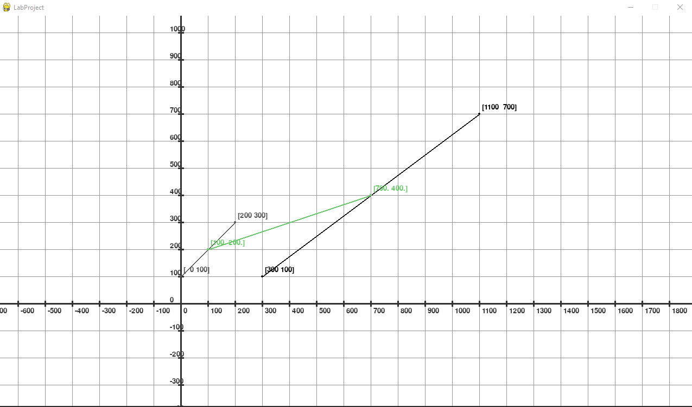
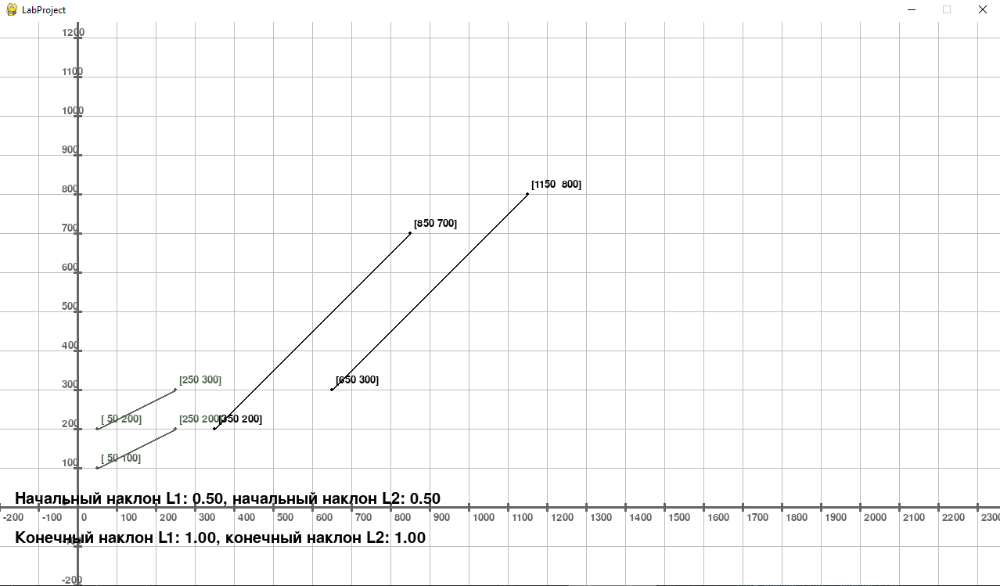
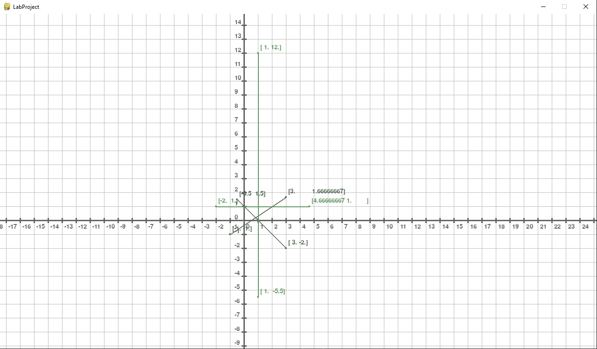
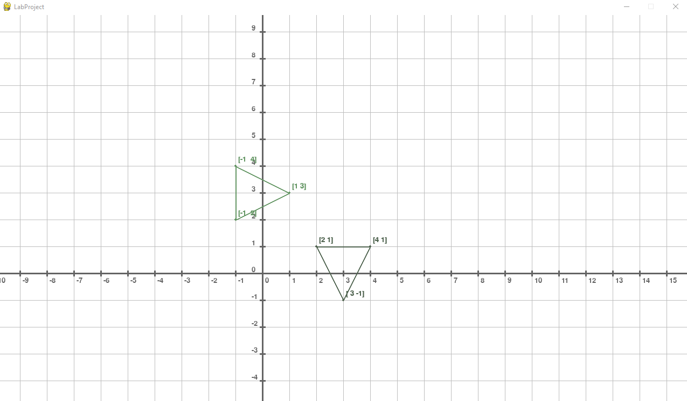
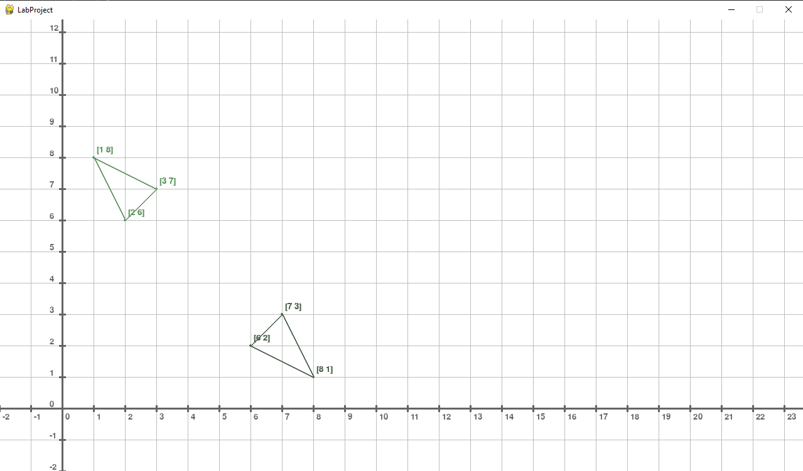
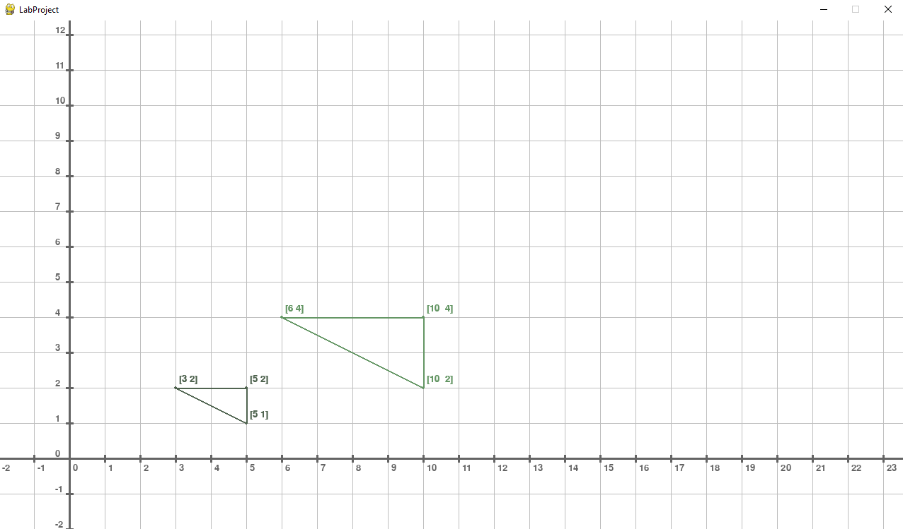

## ОТЧЁТ ПО ЛАБОРАТОРНОЙ РАБОТЕ №2 "ГЕОМЕТРИЧЕСКИЕ ПРЕОБРАЗОВАНИЯ"

[[_TOC_]]

**Оборудование:** ПК, Python, Numpy, Pygame

### Задание №1. 

Напишите программу, которая по материалам лекции преобразовывает концы отрезка $$ L = \begin{pmatrix} 0 & 100 \\ 200 & 300 \end{pmatrix} $$

по заданной матрице преобразования $$ T = \begin{pmatrix} 1 & 2 \\ 3 & 1 \end{pmatrix} $$

Затем рассчитайте середину начального отрезка и с помощью матрицы преобразования найдите середину нового отрезка. Отрезки и середины отрезков прорисуйте на экране с помощью библиотеки pygame.

**Решение:**

Для решения задания была написана следующая программа, используя наработки из лабораторной работы 1.

Создаётся визуальное представление системы координат. Далее с помощью Numpy преобразовывается исходная матрица. 

По следующей формулей находится середина отрезка по данным из матрицы.
$$ T = \begin{bmatrix} \frac{x_1 + x_2}{2} & \frac{y_1 + y_2}{2} \end{bmatrix} $$
 
Точка середины отрезка преобразуется той же матрицей преобразования с помощью чего мы получаем центр уже преобразованного отрезка.

После чего мы создаём визуальное представление исходного отрезка, преобразованного отрезка и отрезка на системе координат по полученным данным.
```python
def __init__(self, screen):
    super().__init__(screen)
    self.is_mouse_down = False
    self.mouse_move_speed = 1
    self.pix_per_unit = 0.5 # <= 50
    self.coords_origin = (100,100)

def start(self):
    self.coords_view = CartesianCoordsView(self.entitys, self.screen, self.coords_origin)
    self.coords_view.setup((50,50,50), (150,150,150), self.pix_per_unit, (3000,2000), int(50/self.pix_per_unit))

    line_data = np.array([[0, 100], [200, 300]])
    transform = np.array([[1, 2], [3, 1]])
    result_line_data = np.matmul(line_data, transform)
    
    line_center = np.array([(end + start)/2 for (start, end) in zip(line_data[0], line_data[1])])
    result_line_center = np.matmul(line_center, transform)

    LineSegment(self.coords_view.subentitys, self.screen, [0,0], self.pix_per_unit, line_data[0], line_data[1], (80,80,80))
    LineSegment(self.coords_view.subentitys, self.screen, [0,0], self.pix_per_unit, result_line_data[0], result_line_data[1])
    LineSegment(self.coords_view.subentitys, self.screen, [0,0], self.pix_per_unit, line_center, result_line_center, (100,200,100))

```
 
Так же был написан небольшой функционал, позволяющий передвигаться по системе координат с помощью мышки:
```python

def handle_event(self, event):
    if event.type == pygame.MOUSEBUTTONDOWN:
        self.is_mouse_down = True
        self.pressed_origin = event.pos
        self.coords_pos_origin = self.coords_view.local_position
        
    if event.type == pygame.MOUSEMOTION and self.is_mouse_down:
        mouse_shift = [pos - origin for (origin, pos) in zip(self.pressed_origin, event.pos)]
        mouse_shift[1] = mouse_shift[1]*-1
        self.coords_view.local_position = [origin + shift * self.mouse_move_speed for (origin, shift) in zip(self.coords_pos_origin, mouse_shift)]
        
    if event.type == pygame.MOUSEBUTTONUP:
        self.is_mouse_down = False           
```
 
Результат выполнения программы:



### Задание №2. 

Напишите программу, которая по материалам лекции преобразовывает параллельные отрезки заданные матрицей (первые две строки - координаты первого отрезка, вторые две координаты второго)
$$ L = \begin{pmatrix} 50 & 100 \\ 250 & 200 \\ 50 & 200 \\ 250 & 300 \end{pmatrix} $$

по заданной матрице преобразования 
$$ T = \begin{pmatrix} 1 & 2 \\ 3 & 1 \end{pmatrix} $$

Затем рассчитайте начальный наклон отрезков и конечный наклон отрезков с дополнительной проверкой по формулам из лекции. Прорисуйте всё на экране с помощью библиотеки pygame.

**Решение:**

Для решения задания была написана следующая программа.

Аналогично прошлой задаче создаётся визуальное представление системы координат. 

С помощью следующего соотношения находится наклон обеих отрезков.

$$ m_1 = \frac{y_2 - y_1}{x_2 - x_1} $$

Далее используя Numpy преобразовывается исходная матрица и по следующей формуле определяется наклон преобразованных отрезков.

$$ m_2 = \frac{ b + d \frac{y_2 - y_1}{x_2 - x_1}}{a + c \frac{y_2 - y_1}{x_2 - x_1}} = \frac{b + dm_1}{a + cm_1}$$

Создаётся визуальное представление двух исходных отрезков и двух отрезков по преобразованным данным.
После чего создаются надписи для отображения вычислений наклонов отрезков.

```python
def __init__(self, screen):
    super().__init__(screen)
    self.is_mouse_down = False
    self.mouse_move_speed = 1
    self.pix_per_unit = 0.5 # <= 50
    self.coords_origin = (100,100)

def start(self):
    self.coords_view = CartesianCoordsView(self.entitys, self.screen, self.coords_origin)
    self.coords_view.setup((100,100,100), (190,190,190), self.pix_per_unit, (3000,2000), int(50/self.pix_per_unit))

    line_data = np.array([[50, 100], [250, 200], [50, 200], [250, 300]])
    transform = np.array([[1, 2], [3, 1]])

    line_slope1 = (line_data[1][1] - line_data[0][1])/(line_data[1][0] - line_data[0][0])
    line_slope2 = (line_data[3][1] - line_data[2][1])/(line_data[3][0] - line_data[2][0])

    result_line_data = np.matmul(line_data, transform)
    
    result_line_slope1 = (transform[0][1]+transform[1][1]*line_slope1)/(transform[0][0]+transform[1][0]*line_slope1)
    result_line_slope2 = (transform[0][1]+transform[1][1]*line_slope2)/(transform[0][0]+transform[1][0]*line_slope2)

    print(result_line_slope1)

    LineSegment(self.coords_view.subentitys, self.screen, [0,0], self.pix_per_unit, line_data[0], line_data[1], (80,100,80))
    LineSegment(self.coords_view.subentitys, self.screen, [0,0], self.pix_per_unit, line_data[2], line_data[3], (80,100,80))
    LineSegment(self.coords_view.subentitys, self.screen, [0,0], self.pix_per_unit, result_line_data[0], result_line_data[1])
    LineSegment(self.coords_view.subentitys, self.screen, [0,0], self.pix_per_unit, result_line_data[2], result_line_data[3])

    Label(self.entitys, self.screen, (20,100), f"Начальный наклон L1: {line_slope1:.2f}, начальный наклон L2: {line_slope2:.2f}", 30)
    Label(self.entitys, self.screen, (20,50), f"Конечный наклон L1: {result_line_slope1:.2f}, конечный наклон L2: {result_line_slope2:.2f}", 30)

```
Результат выполнения программы:



Проверка совпадает с программными значениями.


$$ m_{L_1} = \frac{200 - 100}{250 - 50} = \frac{100}{200} = 0.5 $$
$$ m_{L_2} = \frac{300 - 200}{250 - 50} = \frac{100}{200} = 0.5 $$
$$ m_{L^*_1} = \frac{2 + 1 * 0.5}{1 + 3 * 0.5} = \frac{2.5}{2.5} = 1 $$
$$ m_{L^*_2} = \frac{2 + 1 * 0.5}{1 + 3 * 0.5} = \frac{2.5}{2.5} = 1 $$

### Задание №3. 

Напишите программу, которая по материалам лекции преобразовывает пересекающиеся отрезки заданные матрицей (первые две строки - координаты первого отрезка, вторые две координаты второго) 
$$ L = \begin{pmatrix} -1/2 & 3/2 \\ 3 & -2 \\ -1 & -1 \\ 3 & 5/3 \end{pmatrix} $$

по заданной матрице преобразования 

$$ T = \begin{pmatrix} 1 & 2 \\ 1 & -3 \end{pmatrix} $$

**Решение:**

Для решения задания была написана следующая программа.

Аналогично прошлой задаче создаётся визуальное представление системы координат.

Далее используя Numpy преобразовывается исходная матрица. 

Создаётся визуальное представление двух исходных отрезков и двух отрезков по преобразованным данным.
```python
def __init__(self, screen):
    super().__init__(screen)
    self.is_mouse_down = False
    self.mouse_move_speed = 1
    self.pix_per_unit = 30 # <= 50
    self.coords_origin = (100,100)

def start(self):
    self.coords_view = CartesianCoordsView(self.entitys, self.screen, self.coords_origin)
    self.coords_view.setup((100,100,100), (190,190,190), self.pix_per_unit, (60,20), int(50/self.pix_per_unit))

    line_data = np.array([[-1/2, 3/2], [3, -2], [-1, -1], [3, 5/3]])
    transform = np.array([[1, 2], [1, -3]])
    result_line_data = np.matmul(line_data, transform)
    
    LineSegment(self.coords_view.subentitys, self.screen, [0,0], self.pix_per_unit, line_data[0], line_data[1], (80,100,80))
    LineSegment(self.coords_view.subentitys, self.screen, [0,0], self.pix_per_unit, line_data[2], line_data[3], (80,100,80))
    LineSegment(self.coords_view.subentitys, self.screen, [0,0], self.pix_per_unit, result_line_data[0], result_line_data[1],(100,150,100))
    LineSegment(self.coords_view.subentitys, self.screen, [0,0], self.pix_per_unit, result_line_data[2], result_line_data[3],(100,150,100))
```

Результат выполнения программы:



### Задание №4. 

Напишите программу, которая по материалам лекции вращает фигуру треугольник на 90 градусов против часовой стрелки относительно начала координат 
$$ L = \begin{pmatrix} 3 & -1 \\ 4 & 1 \\ 2 & 1 \end{pmatrix} $$

по заданной матрице преобразования 
$$ T = \begin{pmatrix} 0 & 1 \\ -1 & 0 \end{pmatrix} $$

**Решение:**

Для решения задания была написана следующая программа.

Аналогично прошлой задаче создаётся визуальное представление системы координат.

Далее используя Numpy преобразовывается исходная матрица. 

Создаётся визуальное представление трёх отрезков по исходным данным образующих треугольник и трёх отрезков по преобразованным данным
```python
def __init__(self, screen):
    super().__init__(screen)
    self.is_mouse_down = False
    self.mouse_move_speed = 1
    self.pix_per_unit = 50 # <= 50
    self.coords_origin = (100,100)

def start(self):
    self.coords_view = CartesianCoordsView(self.entitys, self.screen, self.coords_origin)
    self.coords_view.setup((100,100,100), (190,190,190), self.pix_per_unit, (60,20), int(50/self.pix_per_unit))

    line_data = np.array([[3, -1], [4, 1], [2, 1]])
    transform = np.array([[0, 1], [-1, 0]])
    result_line_data = np.matmul(line_data, transform)
    
    LineSegment(self.coords_view.subentitys, self.screen, [0,0], self.pix_per_unit, line_data[0], line_data[1], (80,100,80))
    LineSegment(self.coords_view.subentitys, self.screen, [0,0], self.pix_per_unit, line_data[1], line_data[2], (80,100,80))
    LineSegment(self.coords_view.subentitys, self.screen, [0,0], self.pix_per_unit, line_data[2], line_data[0], (80,100,80))

    LineSegment(self.coords_view.subentitys, self.screen, [0,0], self.pix_per_unit, result_line_data[0], result_line_data[1],(100,150,100))
    LineSegment(self.coords_view.subentitys, self.screen, [0,0], self.pix_per_unit, result_line_data[1], result_line_data[2],(100,150,100))
    LineSegment(self.coords_view.subentitys, self.screen, [0,0], self.pix_per_unit, result_line_data[2], result_line_data[0],(100,150,100))
```

Результат выполнения программы:



### Задание №5. 

Напишите программу, которая по материалам лекции отражает фигуру треугольник относительно прямой y = x 
$$ L = \begin{pmatrix} 8 & 1 \\ 7 & 3 \\ 6 & 2 \end{pmatrix} $$

по заданной матрице преобразования 
$$ T = \begin{pmatrix} 0 & 1 \\ 1 & 0 \end{pmatrix} $$

**Решение:**

Для решения задания была написана следующая программа.

Аналогично прошлой задаче создаётся визуальное представление системы координат.

Далее используя Numpy преобразовывается исходная матрица. 

Создаётся визуальное представление трёх отрезков по исходным данным образующих треугольник и трёх отрезков по преобразованным данным

```python
def __init__(self, screen):
    super().__init__(screen)
    self.is_mouse_down = False
    self.mouse_move_speed = 1
    self.pix_per_unit = 50 # <= 50
    self.coords_origin = (100,100)

def start(self):
    self.coords_view = CartesianCoordsView(self.entitys, self.screen, self.coords_origin)
    self.coords_view.setup((100,100,100), (190,190,190), self.pix_per_unit, (60,20), int(50/self.pix_per_unit))

    line_data = np.array([[8, 1], [7, 3], [6, 2]])
    transform = np.array([[0, 1], [1, 0]])
    result_line_data = np.matmul(line_data, transform)
    
    LineSegment(self.coords_view.subentitys, self.screen, [0,0], self.pix_per_unit, line_data[0], line_data[1], (80,100,80))
    LineSegment(self.coords_view.subentitys, self.screen, [0,0], self.pix_per_unit, line_data[1], line_data[2], (80,100,80))
    LineSegment(self.coords_view.subentitys, self.screen, [0,0], self.pix_per_unit, line_data[2], line_data[0], (80,100,80))

    LineSegment(self.coords_view.subentitys, self.screen, [0,0], self.pix_per_unit, result_line_data[0], result_line_data[1],(100,150,100))
    LineSegment(self.coords_view.subentitys, self.screen, [0,0], self.pix_per_unit, result_line_data[1], result_line_data[2],(100,150,100))
    LineSegment(self.coords_view.subentitys, self.screen, [0,0], self.pix_per_unit, result_line_data[2], result_line_data[0],(100,150,100))
```

Результат выполнения программы:



### Задание №6. 

Напишите программу, которая по материалам лекции масштабирует со смещением фигуру треугольник, заданный матрицей 
$$ L = \begin{pmatrix} 5 & 1 \\ 5 & 2 \\ 3 & 2 \end{pmatrix} $$

по заданной матрице преобразования 
$$ T = \begin{pmatrix} 2 & 0 \\ 0 & 2 \end{pmatrix} $$

**Решение:**

Для решения задания была написана следующая программа.

Аналогично прошлой задаче создаётся визуальное представление системы координат.

Далее используя Numpy преобразовывается исходная матрица. 

Создаётся визуальное представление трёх отрезков по исходным данным образующих треугольник и трёх отрезков по преобразованным данным

```python
def __init__(self, screen):
        super().__init__(screen)
        self.is_mouse_down = False
        self.mouse_move_speed = 1
        self.pix_per_unit = 50 # <= 50
        self.coords_origin = (100,100)

    def start(self):
        self.coords_view = CartesianCoordsView(self.entitys, self.screen, self.coords_origin)
        self.coords_view.setup((100,100,100), (190,190,190), self.pix_per_unit, (60,20), int(50/self.pix_per_unit))

        line_data = np.array([[5, 1], [5, 2], [3, 2]])
        transform = np.array([[2, 0], [0, 2]])
        result_line_data = np.matmul(line_data, transform)
        
        LineSegment(self.coords_view.subentitys, self.screen, [0,0], self.pix_per_unit, line_data[0], line_data[1], (80,100,80))
        LineSegment(self.coords_view.subentitys, self.screen, [0,0], self.pix_per_unit, line_data[1], line_data[2], (80,100,80))
        LineSegment(self.coords_view.subentitys, self.screen, [0,0], self.pix_per_unit, line_data[2], line_data[0], (80,100,80))

        LineSegment(self.coords_view.subentitys, self.screen, [0,0], self.pix_per_unit, result_line_data[0], result_line_data[1],(100,150,100))
        LineSegment(self.coords_view.subentitys, self.screen, [0,0], self.pix_per_unit, result_line_data[1], result_line_data[2],(100,150,100))
        LineSegment(self.coords_view.subentitys, self.screen, [0,0], self.pix_per_unit, result_line_data[2], result_line_data[0],(100,150,100))
```

Результат выполнения программы:



### Вывод

В ходе выполнения данной лабораторной работы была реализованы программы для геометрических преобразований таких как преобразование середины отрезка, параллельных линий, пересекающихся линий, вращение, отражение и масштабирование с помощью Numpy и  графической библиотеки Pygame.
