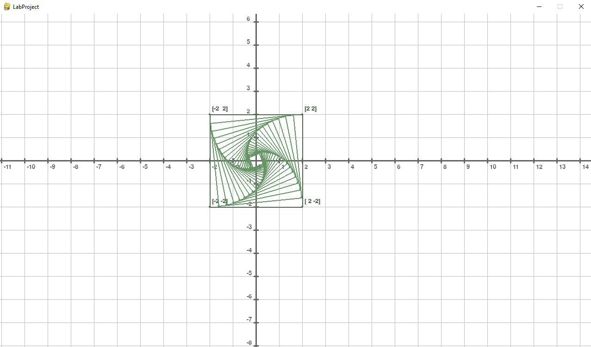
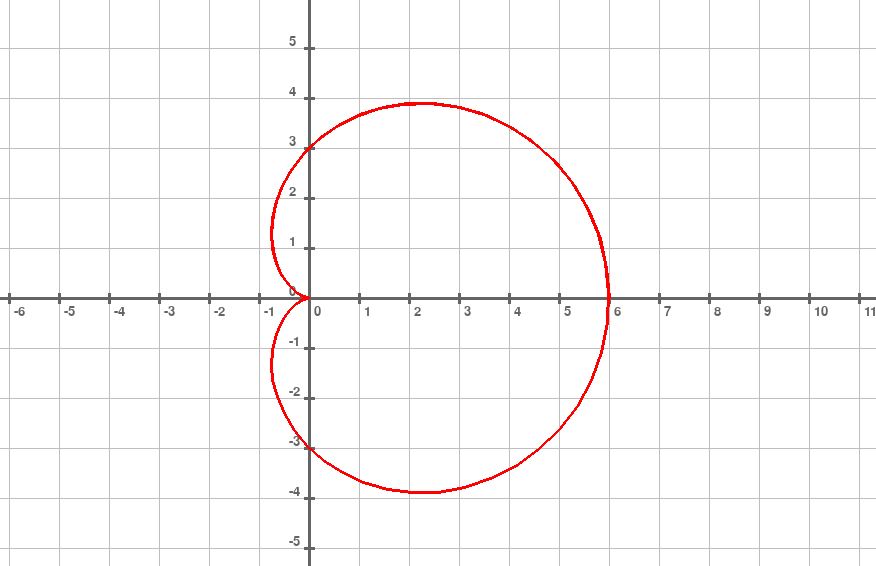
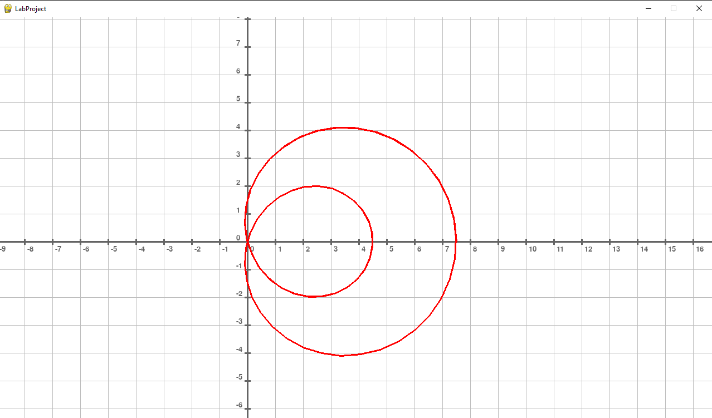

## ОТЧЁТ ПО ЛАБОРАТОРНОЙ РАБОТЕ №3 "Вращения"

[[_TOC_]]

**Оборудование:** ПК, Python, Numpy, Pygame

### Задание №1. 

Напишите программу, которая строит квадрат, затем масштабирует его с коэффициентом m = 0.9 с помощью матрицы масштабирования, а потом вращает этот уменьшенный квадрат на угол α = π/32. Начальные координаты квадрата:
$$ X = \begin{pmatrix} 2 & 2 \\ -2 & 2 \\ -2 & -2 \\ 2 & -2 \end{pmatrix}^T $$

Матрица масштабирования: 
$$ M = \begin{pmatrix} m & 0 \\ 0 & m \end{pmatrix} $$
M=(■(m&0@0&m))

Матрица вращения:
$$ V = \begin{pmatrix} \cos(\alpha) & -\sin(\alpha) \\ \sin(\alpha) & \cos(\alpha) \end{pmatrix} $$

Комбинированное преобразование:
$$ X^{transformed} = V*M*X $$

Затем рассчитайте середину начального отрезка и с помощью матрицы преобразования найдите середину нового отрезка. Прорисуйте на экране с помощью библиотеки pygame 20 таких комбинированных преобразований. Подберите знак α так, чтобы вращение на экране
было против часовой стрелки. 

**Решение:**

Для решения задания была написана следующая программа, используя наработки из лабораторной работы 2.
```python
def __init__(self, screen):
    super().__init__(screen)
    self.is_mouse_down = False
    self.mouse_move_speed = 1
    self.pix_per_unit = 50 # <= 50
    self.coords_origin = (100,100)

def start(self):
    self.coords_view = CartesianCoordsView(self.entitys, self.screen, self.coords_origin)
    self.coords_view.setup((100,100,100), (190,190,190), self.pix_per_unit, (60,40), int(50/self.pix_per_unit))

    m = 0.9
    alpha = math.pi/32
    square_data = np.array([[2, 2], [-2, 2], [-2, -2], [2, -2]])
    scale_trans = np.array([[m, 0], [0, m]])
    rotation_trans = np.array([[math.cos(alpha), -math.sin(alpha)], [math.sin(alpha), math.cos(alpha)]])

    LineSegment(self.coords_view.subentitys, self.screen, [0,0], self.pix_per_unit, square_data[0], square_data[1], (80,100,80))
    LineSegment(self.coords_view.subentitys, self.screen, [0,0], self.pix_per_unit, square_data[1], square_data[2], (80,100,80))
    LineSegment(self.coords_view.subentitys, self.screen, [0,0], self.pix_per_unit, square_data[2], square_data[3], (80,100,80))
    LineSegment(self.coords_view.subentitys, self.screen, [0,0], self.pix_per_unit, square_data[3], square_data[0], (80,100,80))

    result_square_data = square_data
    transform = np.matmul(rotation_trans,scale_trans)
    for i in range(20):
        result_square_data = np.transpose(np.matmul(transform, np.transpose(result_square_data)))
        LineSegment(self.coords_view.subentitys, self.screen, [0,0], self.pix_per_unit, result_square_data[0], result_square_data[1],(100,150,100), labled=False)
        LineSegment(self.coords_view.subentitys, self.screen, [0,0], self.pix_per_unit, result_square_data[1], result_square_data[2],(100,150,100), labled=False)
        LineSegment(self.coords_view.subentitys, self.screen, [0,0], self.pix_per_unit, result_square_data[2], result_square_data[3],(100,150,100), labled=False)
        LineSegment(self.coords_view.subentitys, self.screen, [0,0], self.pix_per_unit, result_square_data[3], result_square_data[0],(100,150,100), labled=False)
```

Результат выполнения программы:



### Задание №2. 

Нарисуйте на экране последовательность соединённых между собой линий в виде улитки Паскаля, используя полярные координаты (r, θ) на плоскости. Формулы для полярного радиуса r и декартовых координат x и y:

$$ r=b+2*a*\cos⁡(\theta) $$
$$ x=r*\cos⁡(\theta) $$
$$ y=r*\sin⁡(\theta) $$

Подберите параметры a, b и шаг по полярному углу θ. Используйте pygame.draw.lines().

**Решение:**

Для решения задания была написана следующая программа.

После создания визуального представления системы кординат, был создан массив с координатами улитки Паскаля. θ был взять от 0 до 10 с шагом 0,1. Далее перед прорисовкой данные переводились в локальную систему координат.

```python
def __init__(self, screen):
    super().__init__(screen)
    self.is_mouse_down = False
    self.mouse_move_speed = 1
    self.pix_per_unit = 50 # <= 50
    self.coords_origin = (100,100)

def start(self):
    self.coords_view = CartesianCoordsView(self.root, self.coords_origin)
    self.coords_view.setup((100,100,100), (190,190,190), self.pix_per_unit, (60,40), int(50/self.pix_per_unit))

    self.lines = []
    for i in np.arange(0, 10, 0.1):
        r = 1.5 + 2 * 3 * math.cos(i)
        self.lines.append([r*math.cos(i),r*math.sin(i)])
    print(self.lines)

def render(self):
    super().render()
    lines = [to_pygame(np.array(p)*self.pix_per_unit+self.coords_view.local_position, self.screen.get_size()[1]) for p in self.lines]
    pygame.draw.lines(self.screen, (255, 0, 0), False, np.array(lines), width=3)
```
 
Результат выполнения программы при $b = 3, a = 1.5$:



Результат выполнения программы при $b = 1.5, a = 3$:



### Вывод 

В ходе выполнения данной лабораторной работы была реализованы программы для вращения и масштабирования с помощью матриц масштабирования и вращения, так же был нарисована улитка Паскаля с помощью Numpy и  графической библиотеки Pygame.