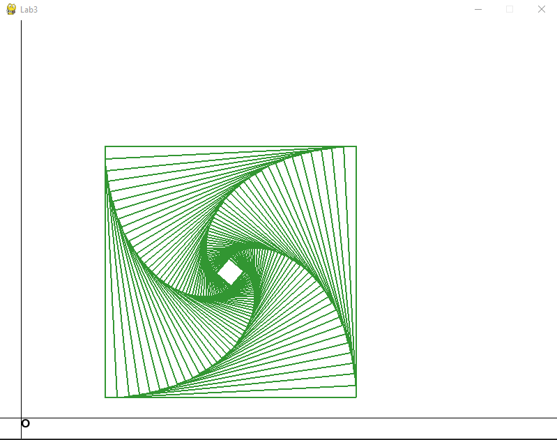

## ОТЧЁТ ПО ЛАБОРАТОРНОЙ РАБОТЕ №4 "Однородные координаты. Система отсчёта"

[[_TOC_]]

**Оборудование:** ПК, Python, Numpy, Pygame

### Задание №1. 

Написать программу, аналогичную заданной в задаче 2.2 предыдущего занятия (преобразование координат квадрата) на языке Python.

Внести при этом в новую программу некоторые модификации и улучшения:
- реализовать преобразование координат задачи в пиксельные координаты в виде функций
    - преобразование для координаты X
    - преобразование для координаты Y
    - преобразование некоторой длины в длину в пикселях
- создать класс Drawer для рисования графических примитивов и реализации графики. Для этого использовать исходники соответствующих функций на C и перевести их на Python как метода этого класса. Инициализировать графику библиотеки pygame внутри метода initialize.
- Использовать однородные координаты для координат исходного квадрата
$$ L = \begin{pmatrix} 2 & 0.5 & 1 \\ 8 & 0.5 & 1 \\ 8 & 0.5 & 1 \\ 2 & 6.5 & 1 \end{pmatrix} $$
- Заменить формулы преобразования для координат вершин квадрата в задаче 2.2 из предыдущего занятия на произведение матриц преобразований в однородных координатах:
$$ L^* = L \times T_{\Delta}(-x_c, -y_c), \times T_S(S_x, S_y), \times T_R(\alpha),\times T_{\Delta}(x_c,y_c) $$
- где $L^*$ матрица с новыми координатами после преобразования, $x_c, y_c$ - координаты точки центра квадрата, $T_{\Delta} ({\Delta}_x, {\Delta}_y)$ - матрица трансляции в однородных координатах на ${\Delta}_x$ по оси $O_x$ и на ${\Delta}_y$ по оси $O_y$; $T_S(S_x, S_y)$ - матрица масштабирования координат точки относительно начала координат, $T_R(\alpha)$ - матрица поворота относительно начала координат против часовой стрелки на угол $\alpha$. Осуществить 50 раз преобразование фигуры квадрат с координатами указанными в начальной матрице L выше по тексту. Параметры преобразования в матрицах:
    - угол поворота в одной итерации: $\alpha = \pi/64$;
    - коэффициенты масштабирования: $S_x = 0.95$, $S_y = 0.95$;
    - координаты центра квадрата xc и yc вычисляются тривиально

Матрицы преобразований в однородных координатах (при h = 1) заданы следующим образом: 

$$ T_{\Delta} ({\Delta}_x, {\Delta}_y) = \begin{bmatrix} 1 & 0 & 0 \\ 0 & 1 & 0 \\ {\Delta}_x & {\Delta}_y & 1 \end{bmatrix} $$
$$ T_S(S_x, S_y) = \begin{bmatrix} S_x & 0 & 0 \\ 0 & S_y & 0 \\ 0 & 0 & 1 \end{bmatrix} $$
$$ T_R(\alpha) = \begin{bmatrix} \cos(\alpha) & \sin(\alpha) & 0 \\ -\sin(\alpha) & \cos(\alpha) & 0 \\ 0 & 0 & 1 \end{bmatrix} $$

**Решение:**

Для решения задания была написана следующая программа.

Модуль *transform* для выполнения преобразований.
```python
import numpy as np
import math as m

def translate(x: float, y: float):
    return np.array([
        [ 1, 0, 0],
        [ 0, 1, 0],
        [ x, y, 1]
    ])

def scale(x: float, y: float):
    return np.array([
        [ x, 0, 0],
        [ 0, y, 0],
        [ 0, 0, 1]
    ])

def rotate(angle: float):
    cs = m.cos(angle)
    sn = m.sin(angle)
    return np.array([
        [ cs, sn, 0],
        [-sn, cs, 0],
        [ 0, 0, 1]
    ])
```

В модуле *graphics* были созданы классы *Origin*, *Unit*, *ReferenceFrame* и *Drawer*.
```python
class Origin:
    def __init__(self, x0: float, y0: float) -> None:
        self.x0 = x0
        self.y0 = y0

class Unit:
    def __init__(self, pixels: int) -> None:
        self.pixels = pixels

class ReferenceFrame:
    def __init__(self, O: Origin, UX: Unit, UY: Unit) -> None:
        self.O = O
        self.UX = UX
        self.UY = UY
```

В классе *Drawer* были реализованы необходимые функции.
```python
class Drawer:
    def __init__(self, res_x: int, res_y: int, rf: ReferenceFrame):
        self.screen_size = (res_x, res_y)
    
    def initialize(self, caption: str):
        pygame.init()
        pygame.display.set_caption(caption)
        self.screen = pygame.display.set_mode(self.screen_size)

    @property
    def color(self):
        return self.__color

    @color.setter
    def color(self, color: tuple):
        self.__color = color
    
    @property
    def font(self):
        return self.__font

    @font.setter
    def font(self, name: str):
        self.__font = pygame.font.SysFont(name, 25)
    
    def draw_text(self, rframe: ReferenceFrame, x: float, y: float, text: str):
        lable = self.font.render(text, True, self.color)
        x = self.get_X(rframe, x)
        y = self.get_Y(rframe, y)
        self.screen.blit(lable, (x,y))

    def draw_line(self, rframe: ReferenceFrame, x1: float, y1: float, x2: float, y2: float, width: int):
        x1 = self.get_X(rframe, x1)
        y1 = self.get_Y(rframe, y1)
        
        x2 = self.get_X(rframe, x2)
        y2 = self.get_Y(rframe, y2)
        pygame.draw.line(
            self.screen,
            self.color,
            (x1,y1),
            (x2,y2),
            width
        )

    def draw_polygon(self, rframe: ReferenceFrame, points: np.array, width: int):
        points = [(self.get_X(rframe, p[0]), self.get_Y(rframe, p[1])) for p in points]
        pygame.draw.polygon(self.screen, self.color, points, width)

    def draw_axes(self, rframe: ReferenceFrame, x_min: float, x_max: float, y_min: float, y_max: float):
        self.draw_line(rframe, x_min, 0.0, x_max, 0.0, 1)
        self.draw_line(rframe, 0.0, y_min, 0.0, y_max, 1)
        self.draw_text(rframe, 0.0, 0.0, "O")

    def get_X(self, rframe: ReferenceFrame, x: float):
        scale_x = rframe.UX.pixels
        x0 = rframe.O.x0
        raw_x = int(scale_x * x + x0)
        return raw_x
    
    def get_Y(self, rframe: ReferenceFrame, y: float):
        scale_y = rframe.UY.pixels
        y0 = rframe.O.y0
        raw_y = int(scale_y * y + y0)
        return self.to_pygame(raw_y, self.screen.get_size()[1])
    
    def get_length(unit: Unit, dl: float):
        return int(dl * unit.pixels)
    
    def to_pygame(self, y, height, obj_height = 0):
        return  height - y - obj_height
```
 
Так же дополнительно была написана функция *to_pygame* для преобразования отрисовки координат с верхнего левого угла приложения в правый нижний угол для удобства.

В модуле *main* инициализируются основные компоненты программы и задаются исходные данные.
```python
import sys
import math as m
import pygame
import numpy as np
from pygame.locals import *
import graphics as g
import transform as t

def main():
    O = g.Origin(30, 30)
    UX = g.Unit(60)
    UY = g.Unit(60)
    rframe = g.ReferenceFrame(O, UX, UY)

    drawer = g.Drawer(800, 600, rframe)
    drawer.initialize("Lab3")
    drawer.font = "freesanbold.ttf"

    square_data = np.array([
        [ 2, 0.5, 1],
        [ 8, 0.5, 1],
        [ 8, 6.5, 1],
        [ 2, 6.5, 1],
    ])

    FPS = 30
    clock = pygame.time.Clock()
```
 
Далее проводится отрисовка с помощью ранее написаных функций и преобразования согласно заданию.
```python
while True:
    drawer.screen.fill((255,255,255))

    drawer.color = (0, 0, 0)
    drawer.draw_axes(rframe, -1.0, 15.0, -1.0, 10.0)
    drawer.color = (50, 150, 50)
    drawer.draw_polygon(rframe,square_data,2)
    new_square_data = square_data
    for i in range(50):
        x_center = sum([p[0] for p in square_data])/4
        y_center = sum([p[1] for p in square_data])/4
        new_square_data = np.matmul(new_square_data, t.translate(-x_center, -y_center))
        new_square_data = np.matmul(new_square_data, t.scale(0.95,0.95))
        new_square_data = np.matmul(new_square_data, t.rotate(m.pi/64))
        new_square_data = np.matmul(new_square_data, t.translate(x_center, y_center))
        drawer.draw_polygon(rframe,new_square_data,2)
    for event in pygame.event.get():
        if event.type == QUIT:
            pygame.quit()
            sys.exit()
    clock.tick(FPS)
    pygame.display.update()
```
 
Результат выполнения программы:



### Вывод

В ходе выполнения данной лабораторной работы была реализованы программы для геометрических преобразований с использованием однородных координат и системы отсчёта.
